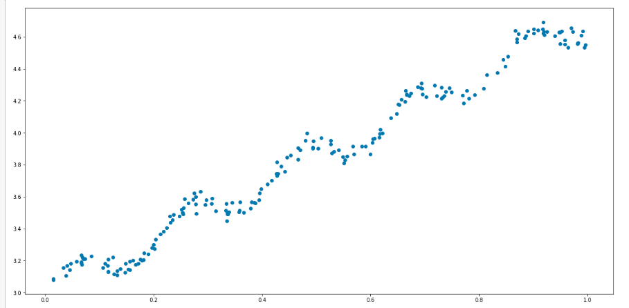
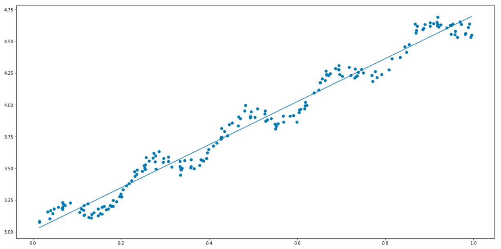

# Linear Regression: Finding best-fit line free from underfitting with Linear Weighted Linear Regression(LWLR)

Regression is a kind of supervised learning where we have a target variable or somthing we want to predict. Linear Regression is used to find a linear relationship between the target and one or more predictors.

Here, we build a standard regression function to create a best-fit line. We will be working with the data found in `data/ex0.txt`.

You can find a walkthrough on my blog

## Requirements
- [Python v3.6](https://www.python.org/)
- [Numpy](http://www.numpy.org/)
- [Matplotlib](https://matplotlib.org/)

## Summary
Using the data from `data/ex0.txt`, we had the following plot

Using linear regression, we were able to have our best-fit liine as below

We discussed that this linear regression tends to underfit the data. It gives us the lowest mean-squared error for unbaised estimators. Hence with underfitting, we aren't getting the best predictions.

We later used Locally Weighted Linear Regression(LWLR) to reduce the mean-square error

